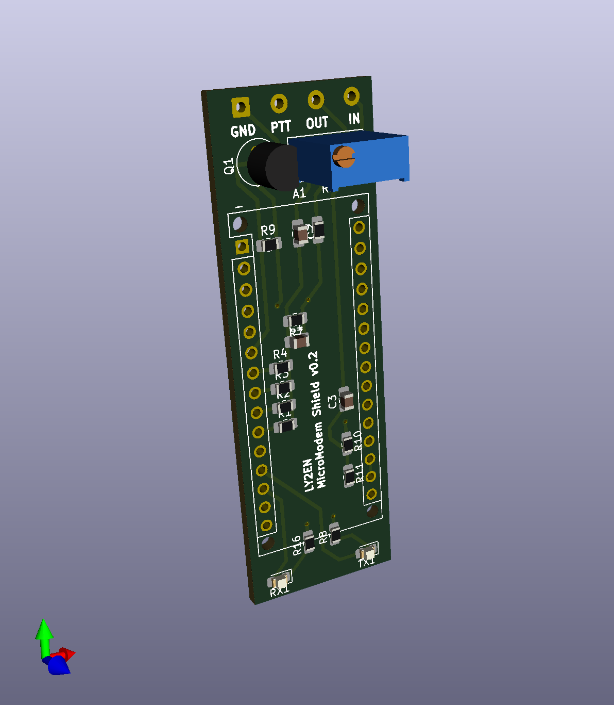

# LY2EN-made MicroModem Arduino Nano shield

PCB and schematics for very basic [MicroModem](https://unsigned.io/micromodem/) shield for
Arduino Nano to use with Baofeng radios.

## Disclaimer

This is experimental work. The authors do not hold any responsibility for any damage to your electronics components, wiring or other property when using this prototype. Use at your own risk.

## Features

### Version 0.3 (verified)
* Upgraded to KiCad version 6
* Fixed edge cut layer (Edge.Cuts)
* Re-rendered PCB 3D visual with ray tracing
* Added JLCPCB compatible BOM and CPL files
* Ordered test batch from JLCPCB :)
* **Verified working!**

### Version 0.2
* Traces widened from 0.25 to 0.5mm
* Added GND area fill on the back side
* Signature added :)

### Version 0.1
* Only the ANALOG_IN, ANALOG_OUT and PTT are exposed.
* PTT wiring has been done as per Baofeng schematics.
* Tested with 3.3V MicroModem's [SimpleSerial](https://github.com/markqvist/MicroAPRS/raw/master/precompiled/microaprs-3v-ss-latest.hex) and [KISS](https://github.com/markqvist/MicroModemGP/raw/master/precompiled/MicroModemGP-3v-kiss.hex) firmware.
* Assuming that RST, XTAL, SPI pins, the CH340 and the rest of stuff is on the Nano already
* Wiring is done for 3.3V, so make sure to use the 3.3V MicroModem hex (see above).

## How to use

Upload the MicroModem KISS firmware to the Arduino Nano:

    avrdude -p m328p -c arduino -P /dev/ttyUSB0 -b 115200 -U flash:w:MicroAPRS.hex

Then plug the Arduino Nano into your [APRSDroid](https://aprsdroid.org/) and select TNC (KISS) mode over USB. Set baud rate to 9600.

## Cables

For non USB-C Nano, a USB-C male to USB-A female adapter is required for recent Android smartphones.

Connect to Baofeng radio over this cable: https://a.aliexpress.com/_mNhKQOm 

Pinout: GND-Blue, PTT-Yellow, IN-Green, OUT-Red

## TODO

* Replace Q1 with SMT version
* Add Bluetooth support

## Authors

PCB made by Simonas Kareiva LY2EN (<ly2en@qrz.lt>) using KiCad and by looking at the [original schematics](https://unsigned.io/wp-content/uploads/2014/12/Schematic-1.pdf).

Inspiration by [Vilius LY3FF](https://github.com/vilisas/).

MicroModem originally by https://github.com/markqvist
